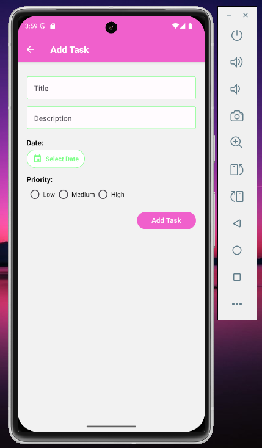
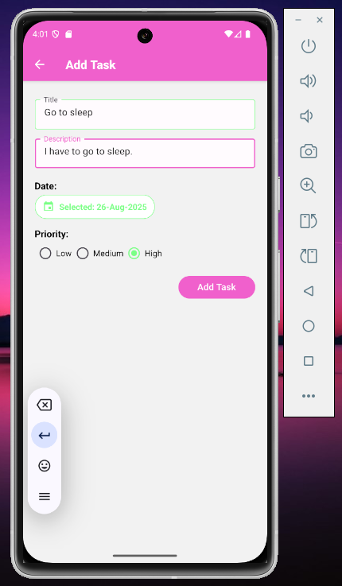
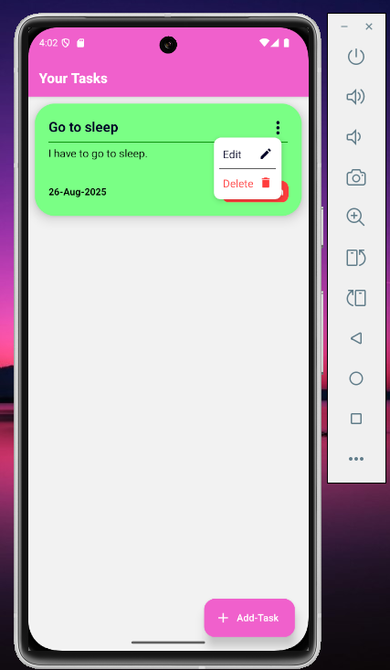
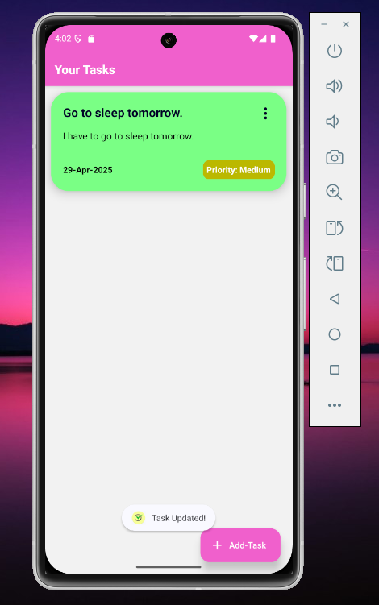
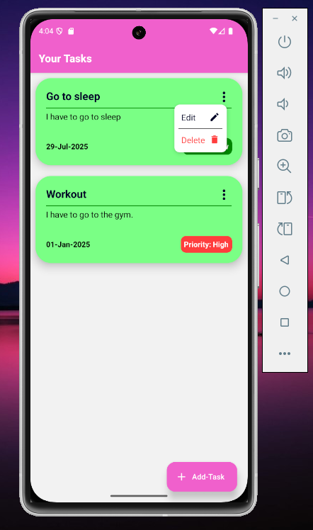
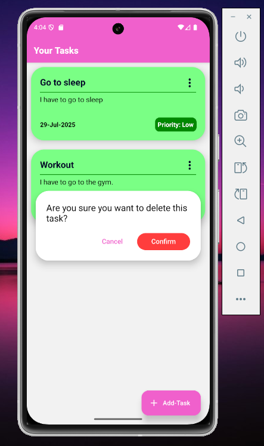

# Note: 
### Screenshots and demo-video of the project are included in the folder 'Screenshots and demo-video' of the repository.

# About This Project
This is a new [**React Native**](https://reactnative.dev) project, bootstrapped using [`@react-native-community/cli`](https://github.com/react-native-community/cli).

This project is a simple android application which allows the user to: 
1) Take a quiz which consists of 5 MCQs
2) The user lands on 'HomeScreen' where they can press 'Start Quiz' button to start the quiz.
3) The user then lands on the 'QuizScreen' where a question is asked with 4 possible options, the user has to choose one and then click on the 'Next' button to get to the next MCQ.
4) The user gets a countdown of maximum 10 seconds to answer each MCQ.
5) The quiz automatically moves on to next MCQ if the user fails to answer it within 10 seconds
6) After the 5 MCQs are finished, the user lands on the 'ResultScreen' where the app shows how many of the answers were correct.
7) User can press the 'Go to Home' button on the 'ResultScreen' to go back to the 'HomeScreen'.

# How To Run This Project
## Step 1: Setup the enviromnet
Make sure you have completed the [Set Up Your Environment](https://reactnative.dev/docs/set-up-your-environment) guide before proceeding.

## Step 2: Build and run your app
Make sure that the 'Android Studio' Emulator is running.
Navigate to the root directory of the project in 'command prompt' and run the following commands:

```sh
npm i
```

wait for packages to finish getting installed. Then run the command:

```sh
npm run android
```
The app will get installed in the 'Android Studio' Emulator and start running.

# Screenshots:










