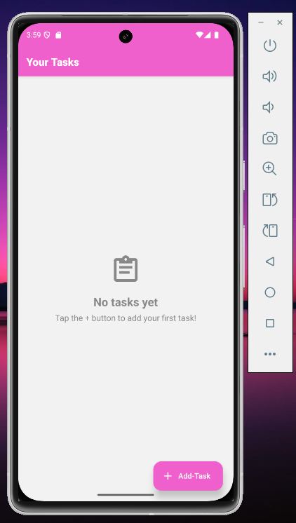
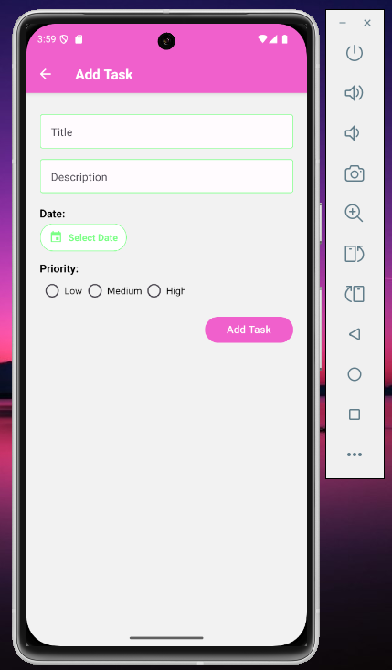
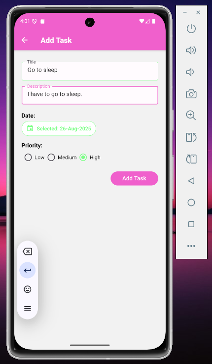
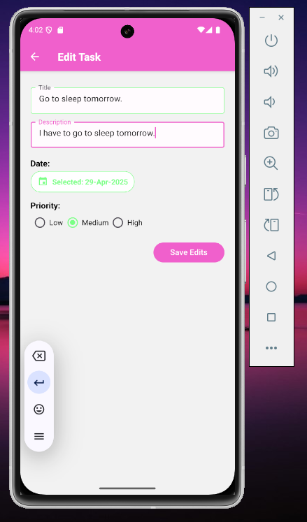
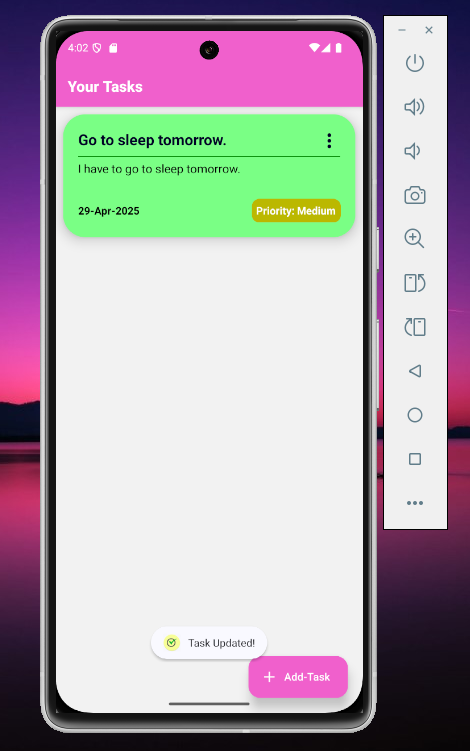
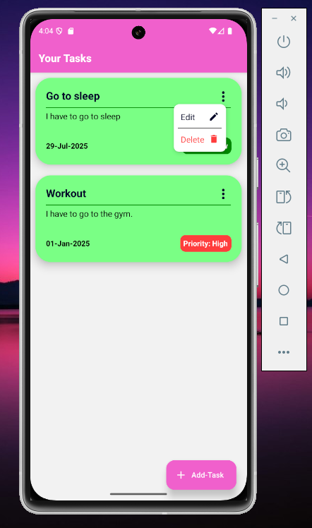
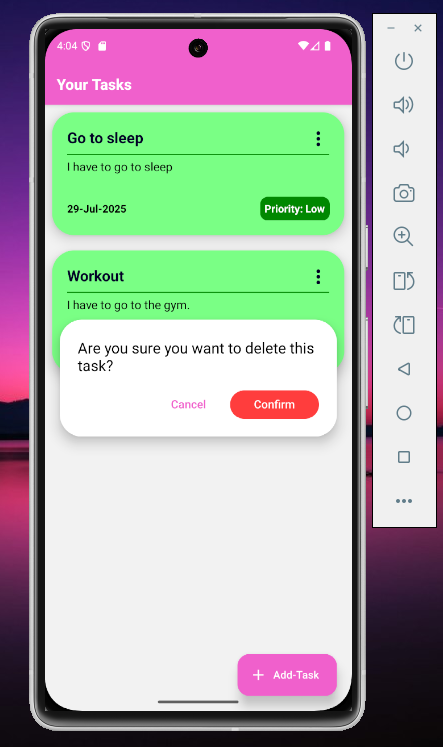
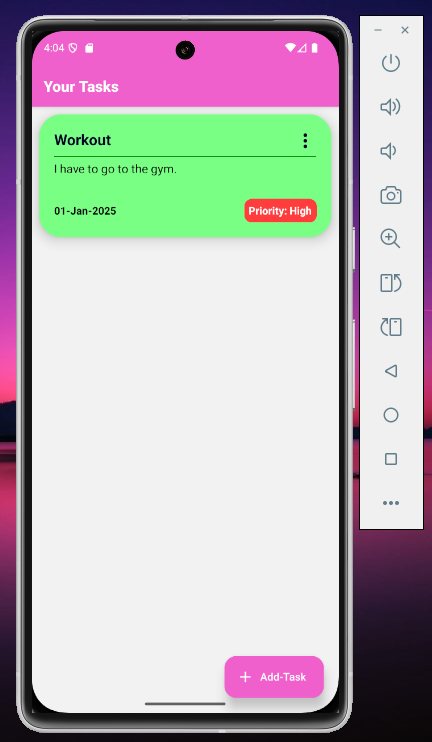

# Note: 
### Screenshots and demo-video of the project are included in the folder 'Screenshots_and_demo-video' of the repository.

# About This Project
This is a new [**React Native**](https://reactnative.dev) project, bootstrapped using [`@react-native-community/cli`](https://github.com/react-native-community/cli).

This project is a simple android application which allows the user to: 
1) Create new tasks.
2) See existing tasks.
3) Edit existing task.
4) Delete existing tasks.
5) Users can set (Title, Description, Date and Priority) of each task.

In this project, the database (local storage) is implemented using SQLite.

# How To Run This Project
## Step 1: Setup the enviromnet
Make sure you have completed the [Set Up Your Environment](https://reactnative.dev/docs/set-up-your-environment) guide before proceeding.

## Step 2: Build and run your app
Make sure that the 'Android Studio' Emulator is running.
Navigate to the root directory of the project in 'command prompt' and run the following commands:

```sh
npm i
```

wait for packages to finish getting installed. Then run the command:

```sh
npm run android
```
The app will get installed in the 'Android Studio' Emulator and start running.

# Screenshots:











# Tech Stack
1) React Native
2) SQLite
